# Piranha: A GPU Platform for Secure Computation (on SciCORE)

<p align="center">
    :D courtesy of Vivian Fang @ vivi.sh" width=20% height=20%/>
</p>

Piranha is a C++-based platform for accelerating secure multi-party computation (MPC) protocols on the GPU in a protocol-independent manner. It is designed both for MPC developers, providing a modular structure for easily adding new protocol implementations, and secure application developers, allowing execution on any Piranha-implemented protocols.

Piranha is described in more detail in our [USENIX Security '22 paper](https://eprint.iacr.org/2022/892)! If you have questions, please create git issues; for eventual replies, you can also reach out to `jlw@berkeley.edu`.

> [!IMPORTANT]
> As part of the 2023 PET+P lecutre of the University of Basel, this repository has been modified to work with [SciCORE](https://scicore.unibas.ch/). The setup process is diffrent compared in the [original repo for Piranha](https://github.com/ucbrise/piranha).

## SETUP AND BUILD

### SETTING UP THE PROJECT
**1. REMOTE INTO SCICORE**

Remote into [SciCORE](https://scicore.unibas.ch/) with your login.

**2. CLONE THE REPOSITORY**
```
git clone https://github.com/Samuraig5/piranha
```

**3. ENTER THE REPO**
```
cd piranha
```

**4. FIND AND DECOMPRESS THE TRAINING DATA**
```
cd files
tar -xvzf MNIST.tar.gz
cd ..
```

**5. CHECKOUT EXTERNAL MODULES**
```
git submodule update --init --recursive
```

---------------------------------------------------------------------------------------------

### BUILD CUTLASS
**1. LOAD CMAKE**
```
ml load CMake/3.23.1-GCCcore-11.3.0
```

**2. LOAD CUDA**
```
ml load CUDA/11.8.0 
```

**3. BUILD CUTLASS**
```
cd ext/cutlass
mkdir build && cd build
cmake .. -DCUTLASS_NVCC_ARCHS=<YOUR_GPU_ARCH_HERE> -DCMAKE_CUDA_COMPILER_WORKS=1 -DCMAKE_CUDA_COMPILER=<YOUR NVCC PATH HERE>
make -j
```

>**NOTE:**
>
> The nvcc arch for the a100 GPU's I used was '80'. 
>
>The nvcc path does not necessarily need to be specified.
>
>For me this command worked:
>```
>cmake .. -DCUTLASS_NVCC_ARCHS=80 -DCMAKE_CUDA_COMPILER_WORKS=1
>```

**4. RETURN TO THE ROOT PIRANHA FOLDER**
```
cd ../../..
```

---------------------------------------------------------------------------------------------
### BUILD PIRANHA

Building Piranha is quite the hassle and requires a very specific series of operations:

**1. PREPARE PROPPER MODULES**
```
ml purge
ml FFTW/3.3.9-gompi-2021a
ml CUDA/11.8.0
```


**2. MAKE PIRANHA (1)**

The following command will compile some of the files but not all. You will recieve some errors. Ignore these. 

> [!WARNING]
> DO NOT clean the make after running this command!

```
make -j8 PIRANHA_FLAGS="-DFLOAT_PRECISION=<BITS_OF_PRECISION> -D<PROTOCOL_CODE>"
```

The exact form of this command will depend on your usage and the test you want to run. These are the protocol codes:

>__Protocol Codes:__
>
>ONEPC -> one party
>
>TWOPC -> two parties (SecureML)
>
>FOURPC -> four parties (fantastic four)
>
>none -> three parties (Falcon)

and example for such a make command is

```
make -j8 PIRANHA_FLAGS="-DFLOAT_PRECISION=26 -DTWOPC"
```

**3. LOAD NEW MODULES**
```
ml purge
ml CMake/3.23.1-GCCcore-11.3.0
ml CUDA/11.8.0
```

**4. MAKE PIRANHA (2)**

Now we can finish making Piranha. Use the exact same command you used in step 2. This time you should not see any errors and the binary file should be in the root folder of piranha.

If you want to experiment with multiple piranha builds, it might be worth it to rename them. My naming scheme was:

```
piranha_<precision>_<number of parties>
```

**5. RUN PIRANHA**
```
./piranha -p <PARTY NUM> -c <CONFIG FILE>
```

Again, the exact form of this command will change from party to party and from test to test.
Loosly speaking, you want to 

Set up a run configuration using config.json as a base. 
Run Piranha on each machine with a party number (0 -> n_parties - 1):


### Running locally

In the SciCORE setting we want to run Piranha on a local machine. An example configuration for 3-party local execution can be found at `files/samples/localhost_config.json` accompanying runfile but all configs and files in `piranhaBuilds` are also running locally. You can modify the runfiles to change which GPUs Piranha uses for each party using the `CUDA_VISIBLE_DEVICES` environment variable. Note that due to contention, hosting several parties on a single GPU will limit the problem sizes you can test and incur some additional overhead.

---------------------------------------------------------------------------------------------
---------------------------------------------------------------------------------------------

## Changes
I had to undertake significant changes to the project inorder to get parts of it to work (huge shout out to Osman of the PET+P course).
Here I will list the most significant and the resoning for the changes:

**1. Makefile**

The Makefile as such did not work. We had to change so many things in it that I've lost track of every detail. In broad strokes we changed how the GTest library was included, the currently used CUDA library and the path to the nvcc installation as it is not the same as in usual installations. 

**2. Training Data**

The python scripts provided for the download and creation of the MNIST and CIFAR10 datasets did not work in SciCORE. Instead I created the MNIST on a local machine and tranfered the already prepared data to SciCORE. If you want to use CIFAR10 you will have to build it locally with the scripts in `scripts` and then transfer them to SciCORE. For more details see the [original repo for Piranha](https://github.com/ucbrise/piranha).

**3. GTest**

Since GTest as a module was not availalbe on SciCORE we had to pull it from GitHUB and build it on SciCORE.

**4. Building Piranha**

Building Piranha was a significant challange and need a very specific but non-obvious chain of execution (hence the wierd build instructions). The other changes all come stem from this one problem that took a full week to work around.

---------------------------------------------------------------------------------------------
---------------------------------------------------------------------------------------------


## PROJECT
I've analysed the code and identified several aspects and parameters I'd like to investigate.

### Parameters
**Bold Parameters** are of especially great intrest.

In the config files we can change these parameters:
* *num_parties*
    * Should be set to match the specific MPC protocol used
* party_ips
* **network**
    * Neural network that should be trained
* custom_epochs(_count)
* custom_itirations(_count)
* custom_batch_size(_count)
* *preload(_path)*
    * Allows for the preloading of a neural network. Probably won't be used in my project.

In the build command we can further change these parameters
* **Fixed Point Precision**
    * Number of bits used for precision
* **Protocol Used**
    * MPC protocol used

By adjusting these boolean parameters in the config files we can change what output we want:
* eval_accuracy
* eval_inference_stats
* eval_train_stats (includes time)
* eval_fw_peak_memory
* eval_bw_peak_memory
* eval_epoch_stats

---------------------------------------------------------------------------------------------

### Project Questions
The following are the questions I'd like to investigate. They allow me to compare my results with the orignial paper while hopefully allowing me to find some of my own insight.

* Can we reproduce the results from Figure 5 (Fixed Point Precision - Accuracy graph)?
* Does the number of bits used for Fixed Point Precision impact runtime or memory usage?
* How does memory usage and runtime vary from one NN model - MPC protocol pair to the others?
* Can we reporduce the results from Table 2 (Comparing diffrent NN and MPC protocol combinations)?

---------------------------------------------------------------------------------------------

### Runs

> [!NOTE]
> Due to technical difficulties building piranha and slower than expected computation, I was unable to perform the tests and experiments as I wanted to. The concept (and files) are none the less useful in my opition and I will leave them here.
>To see the experiments I actually ran go the the next section called Anaysis.

The following is the file structure of the experiments:
Each folder has three config files with the parameters and a runner file to launch the Piranha clients.

Each file is named after its most important parameters:
```
<num_parties>_<NN_model>_<epoch_num>_<itiration_num>_<batch_size>_config.json
```
If a value was not set custom in the config file, it will carry an 'f' for false.

Memory experiment configs have the prefix 'mem_'.

The instruction for each experiment is written in the runer files.
I will briefly summarize the experiments here:

#### Runtime Experiments:
#### 26 bit precision 2,3,4 PC
Build Piranha with a fixed point precision of 26 bits for two, three and four parties. Then run the respective runner file for each NN model, three times for the two party, the three party and the four party setup. 

#### Memory Experiments:
#### 26 bit precision 2,3,4 PC
Build Piranha with a fixed point precision of 26 bits for two, three and four parties. Then run the respective runner file for each NN model, three times for the two party, the three party and the four party setup. 

#### 12 bit precision 2,3,4 PC
Build Piranha with a fixed point precision of 12 bits for two, three and four parties. Then run the respective runner file for each NN model, three times for the two party, the three party and the four party setup. 

#### 12 - 26 bit precision 2 PC
Build Piranha with a fixed point precision of 12, 14, 16, 18, 20, 22, 24 and 26 bits for two parties. Then run the respective runner file for each NN model, three times for each build. 

> [!WARNING]
> The runnerfiles did not work for me but should be correct. If you want to use Piranha without the runnerfiles, the easiest way is to move your Piranha binary into the folder containing your chosen config and then running the command listed at the end of 'Build Piranha'. If you want to use the runnerfiles, be sure to edit the runner file to select the correct configuration for your need and MPC protocol.

```
📦piranhaBuilds
 ┣ 📂memoryExperiments
 ┃ ┣ 📂lenet
 ┃ ┃ ┣ 📜mem_2pc_lenet_e10_if_b256_config.json
 ┃ ┃ ┣ 📜mem_2pc_lenet_ef_i10_b256_config.json
 ┃ ┃ ┣ 📜mem_3pc_lenet_e10_if_b256_config.json
 ┃ ┃ ┣ 📜mem_4pc_lenet_e10_if_b256_config.json
 ┃ ┃ ┗ 📜mem_lenet_e10_if_b256_runner.sh
 ┃ ┗ 📂secureml
 ┃ ┃ ┣ 📜mem_2pc_secureml_e10_if_b256_config.json
 ┃ ┃ ┣ 📜mem_2pc_secureml_ef_i10_b256_config.json
 ┃ ┃ ┣ 📜mem_3pc_secureml_e10_if_b256_config.json
 ┃ ┃ ┣ 📜mem_4pc_secureml_e10_if_b256_config.json
 ┃ ┃ ┗ 📜mem_secureml_e10_if_b256_runner.sh
 ┣ 📂runtimeExperiments
 ┃ ┣ 📂lenet
 ┃ ┃ ┣ 📜2pc_lenet_e10_if_b256_config.json
 ┃ ┃ ┣ 📜2pc_lenet_ef_i30_b256_config.json
 ┃ ┃ ┣ 📜3pc_lenet_e10_if_b256_config.json
 ┃ ┃ ┣ 📜4pc_lenet_e10_if_b256_config.json
 ┃ ┃ ┗ 📜lenet_e10_if_b256_runner.sh
 ┃ ┗ 📂secureml
 ┃ ┃ ┣ 📜2pc_secureml_e10_if_b256_config.json
 ┃ ┃ ┣ 📜2pc_secureml_ef_i10_b256_config.json
 ┃ ┃ ┣ 📜2pc_secureml_ef_i30_b256_config.json
 ┃ ┃ ┣ 📜3pc_secureml_e10_if_b256_config.json
 ┃ ┃ ┣ 📜3pc_secureml_ef_i30_b256_config.json
 ┃ ┃ ┣ 📜4pc_secureml_e10_if_b256_config.json
 ┃ ┃ ┗ 📜secureml_e10_if_b256_runner.sh
 ┣ 📜piranha_12_three
 ┣ 📜piranha_12_two
 ┣ 📜piranha_16_three
 ┣ 📜piranha_16_two
 ┣ 📜piranha_26_three
 ┗ 📜piranha_26_two
```

---------------------------------------------------------------------------------------------

### Analysis
All the data that was produced, was saved to a excel table together with the name of the config file and important parameter settings it was produced under. 
This excel file is included in the git: `Piranha_Project_Data.xlsx`.

#### **Runtime Experiments**
In the runtime experiments I want to investigate the runtime behaviour of Piranha. What influences runtime and how does it tradeoff with accuracy? I want to get a feel for the general behaviour so we would be able to select the proper parameters depending on our time and accuracy requirements.

1. What SciCORE Instance to use

Since I didn't know how many SciCORE OnDemand resources I should reserve I performed a quick test. I locally trained a SecureML NN model with a 2PC MPC protocol on a 'Medium' instance (14 core, 90GB RAM) and a 'XLarge' instance (42 core, 270GB RAM). I used the same build and the '2pc_secureml_e10_if_b256_confic.json' configuration for both runs.

It turns out that there is no significant diffrence in either runtime or accuracy when comparing the 'Medium' instance run to the 'XLarge' instace run. Presumably piranha is already using all the resources it can in the 'Medium' instance and the extra RAM and cores of the 'XLarge' instance remain idleing. 

Concerning is that on the paper they show a table where they achieved 97% accuracy in only 13 minutes. Which is a improvement of 2% and much faster than our runtime.
Obviously my configuration is flawed. In the next experiment I will try a diffrent configuration and compare to this one.

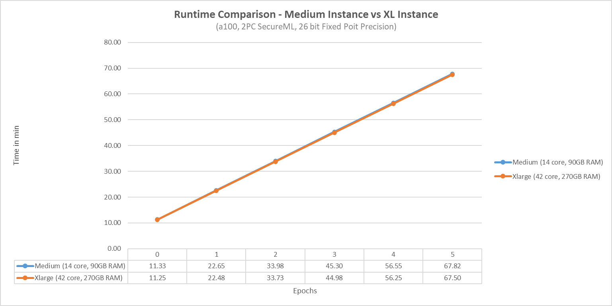
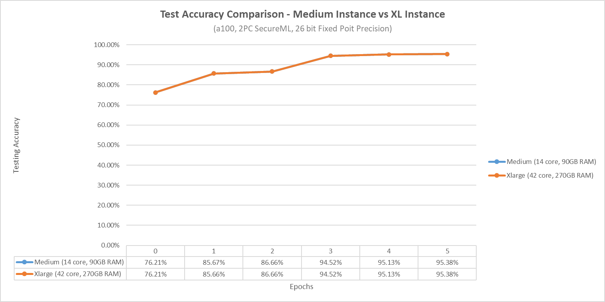

2. Epochs vs Iterations

I created a new config called '2pc_secureml_ef_i10_b256_confic.json which disabled the custom epochs and enabled custom iterations, setting them to 10.

We can see that we get a massive improvement in our runtime. Where before it took us over an hour to get to epoch 6, we can now complete computation in just under 5 minutes.

This however comes with a big drawback: Our accuracy dropped from 95% at just epoch 6 to just 67% at epoch 10. I belive that the standart number of epochs, if no custom amount is set, is ten but that the standart number of iterations per epoch is far greater than 10. I will test this in the next experiment.

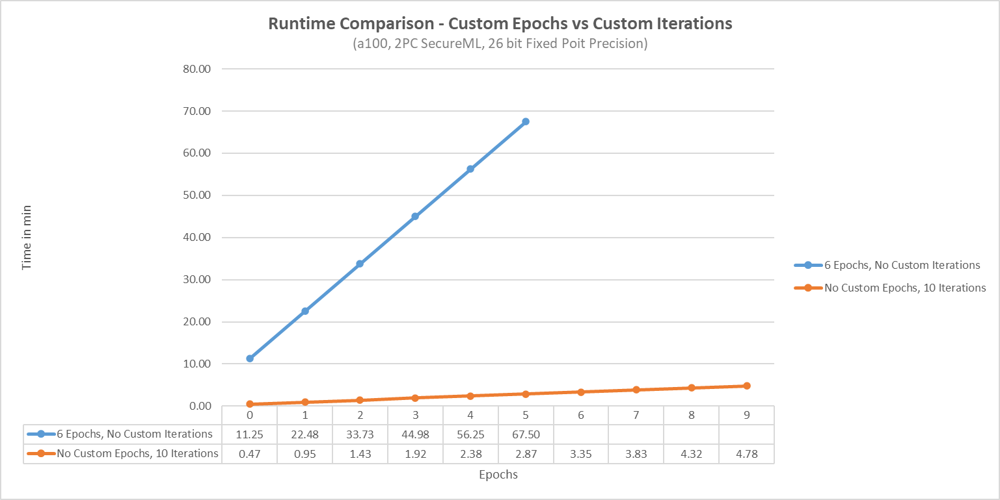
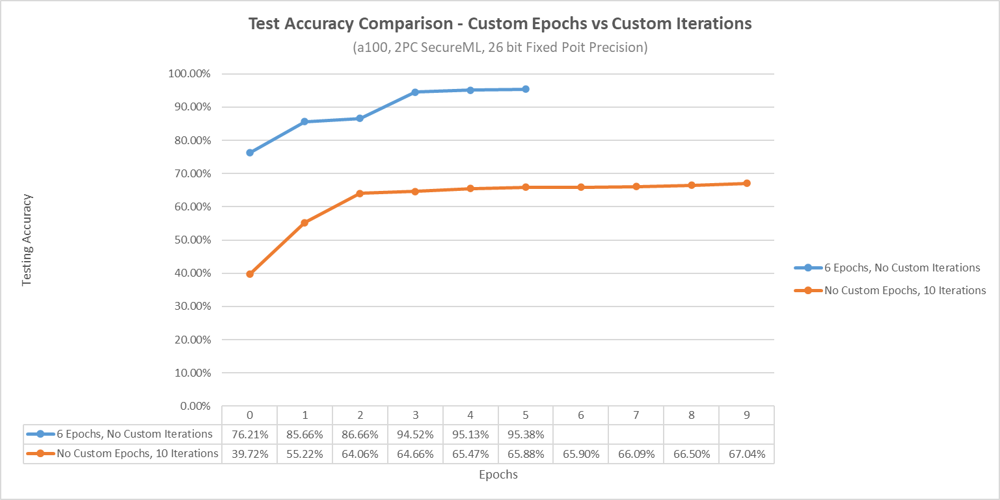

3. Runtime of diffrent Iteration counts

These results are what we would expect. Runtime is slower (still faster than when no custom iterations count was set) but accuracy has improved (but is still lower than in our initial case).

It seems that the higher our accuracy is, the more difficult it is to improve further, which is what we would expect.

Intresstingly it seems that in all cases, our accuracy doesn't much improve after the third epoch.

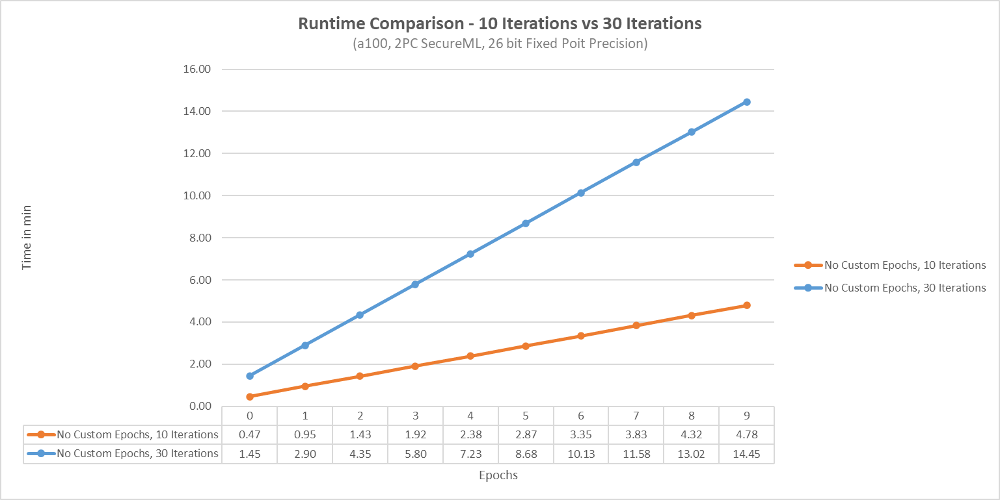
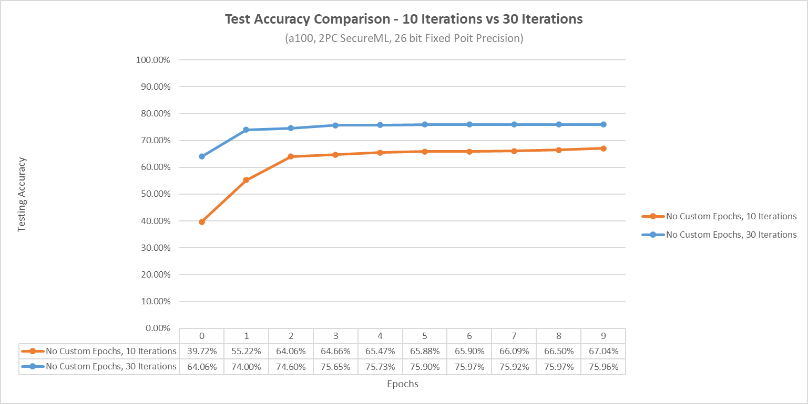

4. SecureML vs LeNET

Comparing the neural networks SecureML and LeNET, both run with the same parameters on the 2-PC MPC protocol P-SecureML, it is apparent that LeNET performs much worse. Its runtime is over double that of SecureML and its accuracy is less than half that of SecureML. 

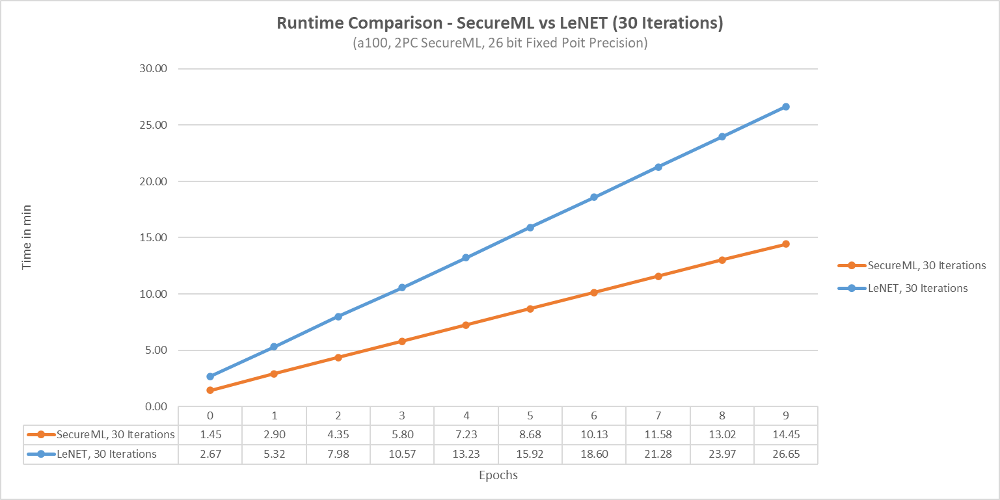
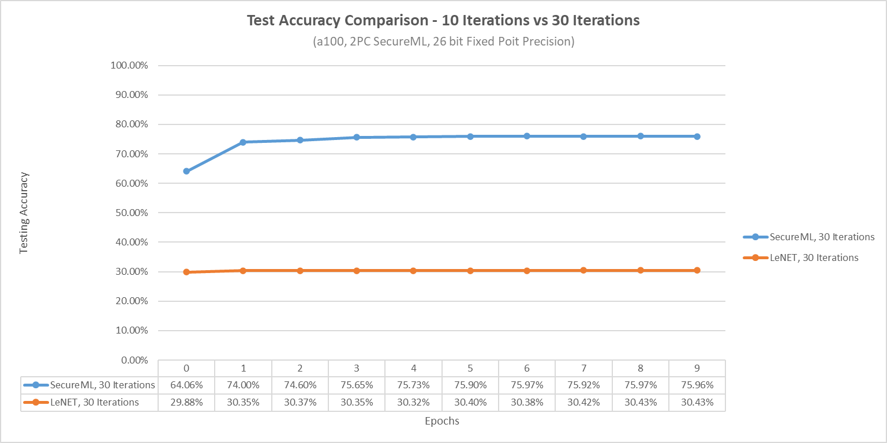

5. 26-bit accuracy vs 12-bit accuracy (2 PC)

We can see that the runtime stays the same, no matter the number of bits used for precision and while accuracy is lower in the 12-bit build compared to the 26 bit build, it is not close to the 10% the paper speaks of. 

The paper used P-Falcon, a 3-PC MPC protocol whereas we are using SecureML. A 2-PC protocol. Lets try this experiment again with the 3-PC protocol.

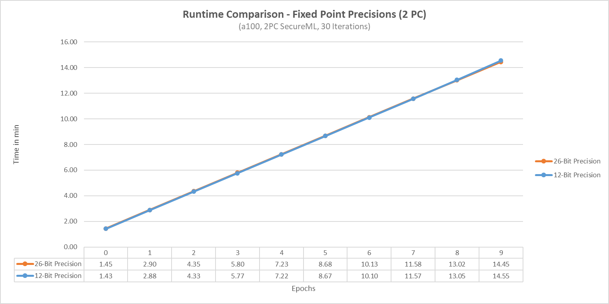
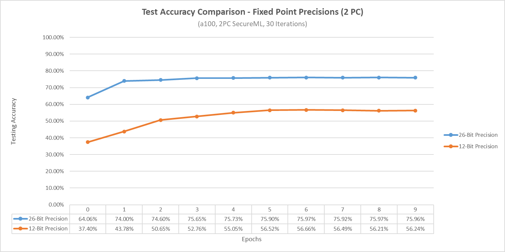

6. 26-bit accuracy vs 12-bit accuracy (3 PC)

The values collected in this run go against what we would expect. Not only does it fail to reproduce the values the paper mentioned but even worse, the two runs are almost idendical. This leads me to believe that the precision bit number may not be parsed correctly when building piranha.

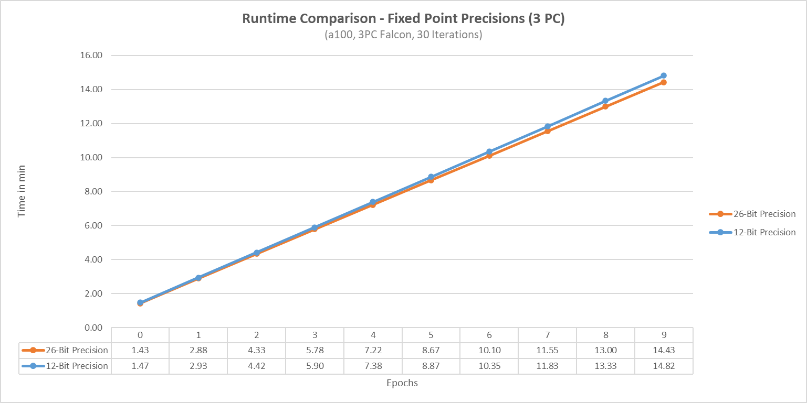
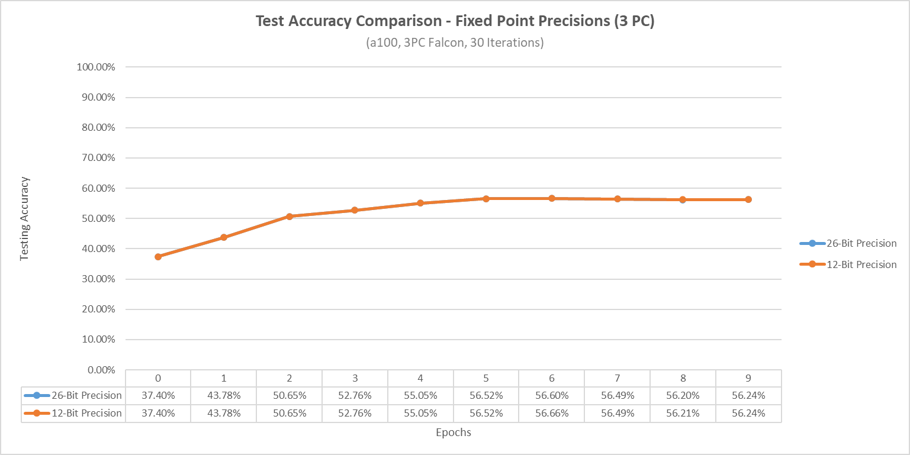

---------------------------------------------------------------------------------------------

#### **Memory Experiments**
We have performed quite a few runtime experiments now I'd like to do just a few memory experiments aswell:

I will compare SecureML to LeNET with 12-bit and the 26-bit precision to see if the precision has any effect on memory usage.

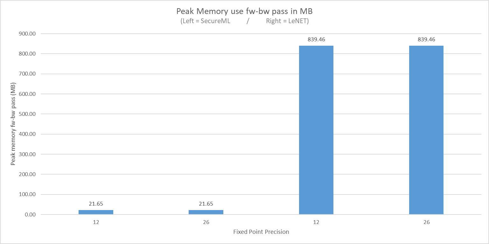!

Sadly the results are not impressive not did they arrive as I expected. I expected to get values simmilar to Figure 7 in the paper. Unfortunatly, every single pass in every single epoch returns the same MB amount, irrespective of the amount of bits used for fixed point precision.